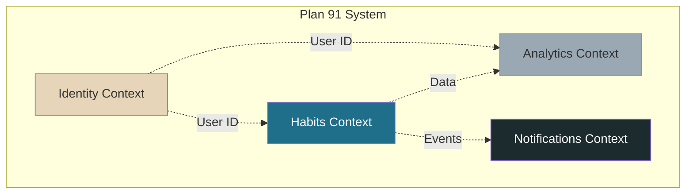
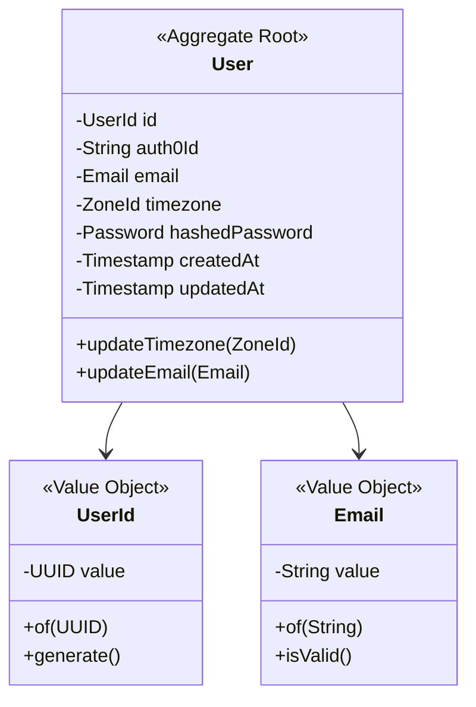
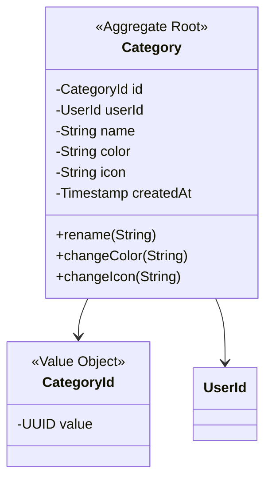
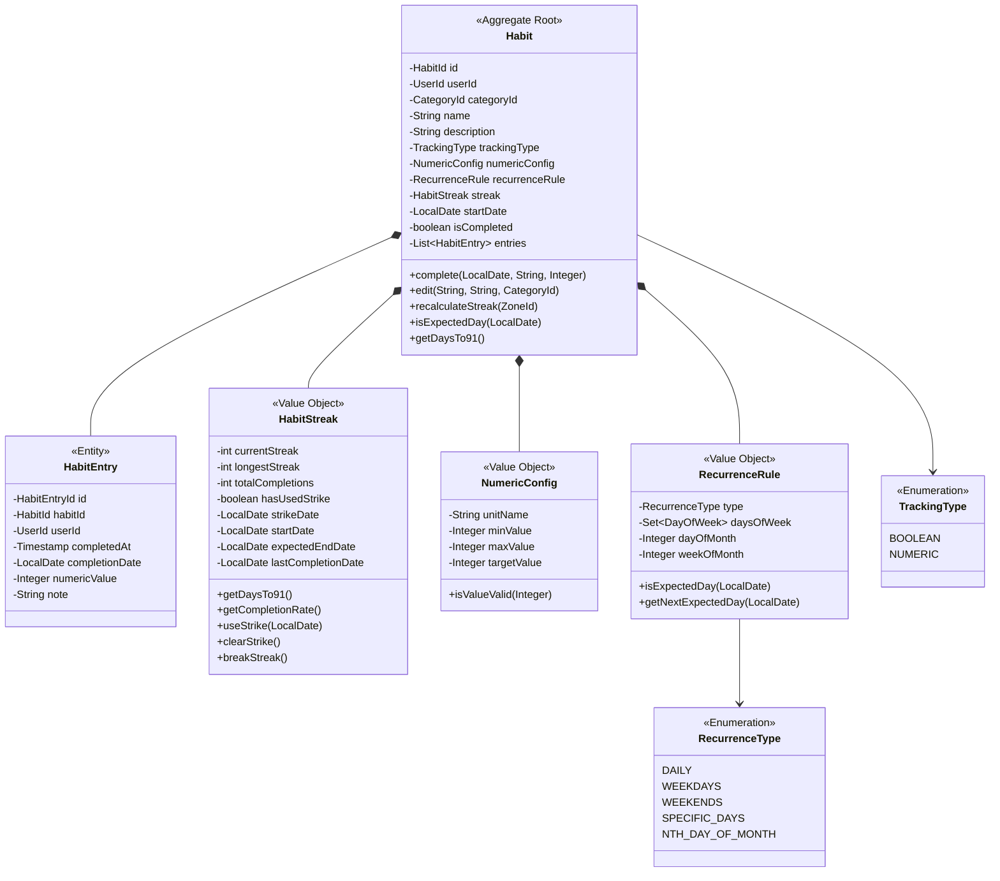
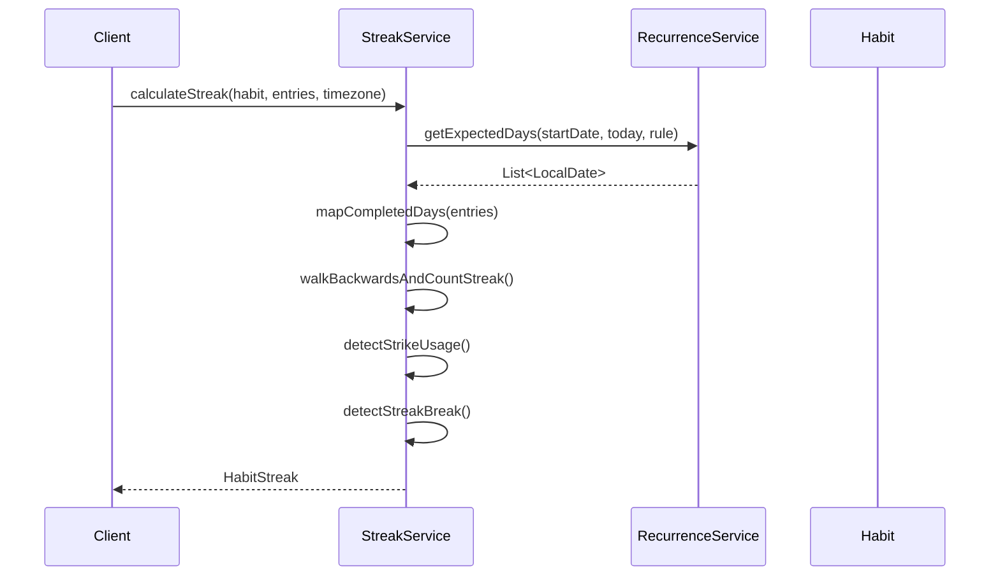
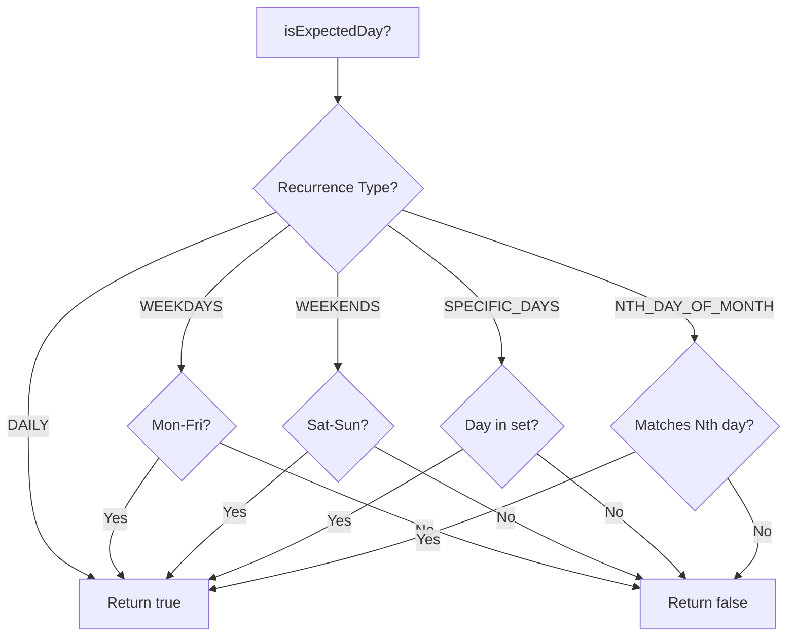
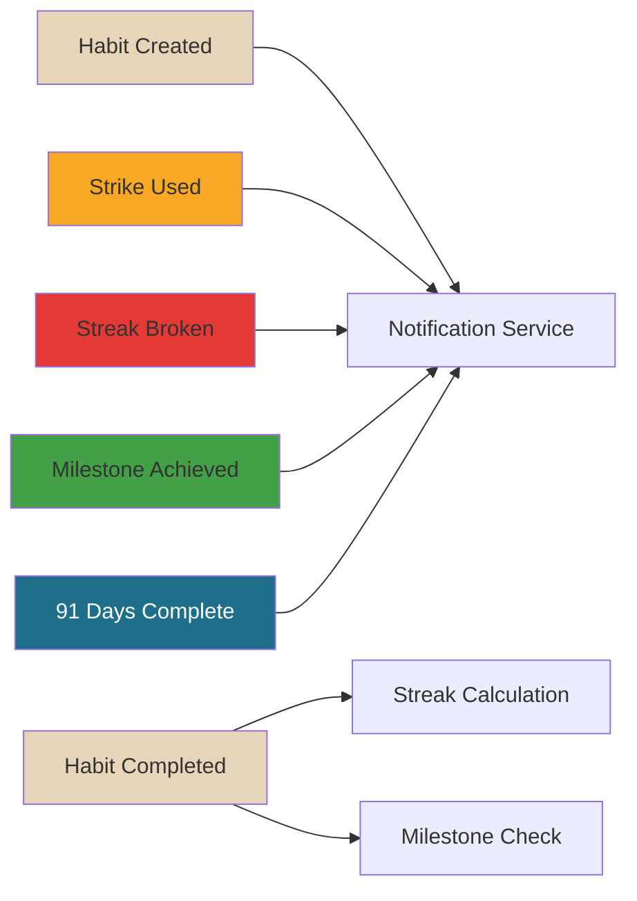
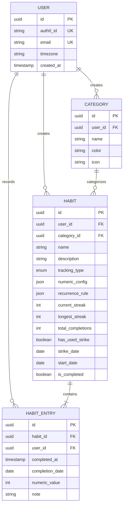
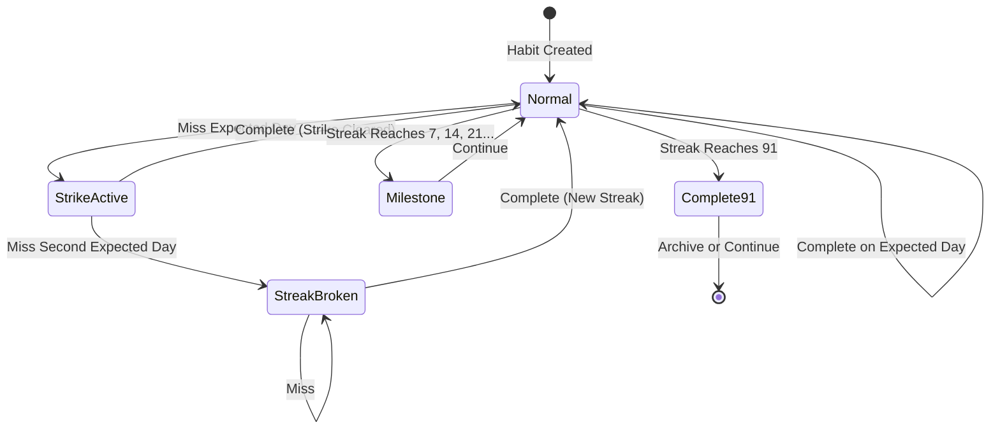
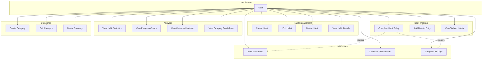

# Plan 91 - Domain Model

**Version**: 1.0
**Last Updated**: 2026-01-29

This document provides a detailed view of the Plan 91 domain model using Domain-Driven Design (DDD) principles.

---

## Table of Contents

1. [Domain Overview](#domain-overview)
2. [Bounded Contexts](#bounded-contexts)
3. [Aggregates](#aggregates)
4. [Domain Services](#domain-services)
5. [Domain Events](#domain-events)
6. [Business Rules](#business-rules)
7. [Diagrams](#diagrams)

---

## Domain Overview

Plan 91 is built around the core concept of **habit tracking with a forgiving accountability system**.

### Core Concepts
- **91-Day Cycle**: The fundamental commitment period for habit formation
- **One-Strike Rule**: Users can miss once without penalty, but not twice consecutively
- **Streak Tracking**: Counts consecutive completions on expected days
- **Recurrence Rules**: Flexible scheduling (daily, weekdays, custom)
- **Numeric vs Boolean Tracking**: Track completion or measure quantity

---

## Bounded Contexts



### Identity Context
**Responsibility**: User management and authentication
**Core Concept**: User identity, timezone management
**External Dependency**: Auth0

### Habits Context (CORE)
**Responsibility**: Habit lifecycle, tracking, streak calculation
**Core Concept**: Habits, Entries, Categories, Streaks
**This is the heart of the application**

### Analytics Context
**Responsibility**: Statistics, visualizations, insights
**Core Concept**: Aggregated data, charts, reports

### Notifications Context
**Responsibility**: Milestones, achievements, reminders
**Core Concept**: Events, notifications, kudos

---

## Aggregates

### Aggregate: User (Identity Context)



**Business Rules**:
- Email must be unique across all users
- Timezone is required (defaults to UTC)
- Auth0 ID links to external identity provider
- Password must be securely hashed (BCrypt)

---

### Aggregate: Category (Habits Context)



**Business Rules**:
- Category names must be unique per user
- Color must be valid hex color (#RRGGBB)
- Cannot delete category with associated habits (or must reassign first)
- Icon is optional (emoji or identifier)

---

### Aggregate: Habit (Habits Context - CORE)



**Business Rules**:
- Name required (max 100 chars)
- Description optional (max 500 chars)
- Start date cannot be changed after creation
- One completion per calendar day maximum
- Cannot backdate completions
- Streak calculation considers user timezone
- Numeric habits require NumericConfig
- Boolean habits ignore numeric values

---

## Domain Services

Domain Services contain business logic that doesn't naturally belong to a single entity.

### StreakCalculationService



**Responsibilities**:
- Calculate current streak
- Detect strike usage
- Detect streak breaks
- Calculate longest streak
- Count total completions
- All calculations timezone-aware

**Key Algorithm**:
```
For each expected day (from today backwards):
    If completed:
        Increment streak
        Clear last miss tracking
    Else (missed):
        If already missed once before:
            Streak broken - STOP
        Else if strike not yet used:
            Use strike
            Mark strike date
            Continue streak
        Else:
            Streak broken - STOP
```

---

### RecurrenceEvaluationService



**Responsibilities**:
- Determine if a date is an "expected day" for a habit
- Generate list of expected days in a date range
- Handle all recurrence types
- Support complex patterns (e.g., "First Monday of each month")

---

## Domain Events

Events represent significant occurrences in the domain.



### Event Types

**HabitCreated**
```java
{
    habitId: UUID,
    userId: UUID,
    name: String,
    startDate: LocalDate,
    occurredAt: Timestamp
}
```

**HabitCompleted**
```java
{
    habitId: UUID,
    userId: UUID,
    completionDate: LocalDate,
    numericValue: Integer?, // optional
    occurredAt: Timestamp
}
```

**StrikeUsed**
```java
{
    habitId: UUID,
    userId: UUID,
    strikeDate: LocalDate,
    occurredAt: Timestamp
}
```

**StrikeCleared**
```java
{
    habitId: UUID,
    userId: UUID,
    occurredAt: Timestamp
}
```

**StreakBroken**
```java
{
    habitId: UUID,
    userId: UUID,
    finalStreak: int,
    occurredAt: Timestamp
}
```

**MilestoneAchieved**
```java
{
    habitId: UUID,
    userId: UUID,
    milestoneDay: int, // 7, 14, 21, 30, etc.
    habitName: String,
    occurredAt: Timestamp
}
```

**Habit91DaysComplete**
```java
{
    habitId: UUID,
    userId: UUID,
    habitName: String,
    finalStreak: int,
    occurredAt: Timestamp
}
```

---

## Business Rules

### Streak Calculation Rules

**Rule 1: Consecutive Expected Days**
> A streak is the count of consecutive completions on days where the habit was expected, according to its recurrence rule.

**Example**: A weekday-only habit completed Mon-Fri has a 5-day streak, even though Saturday/Sunday passed.

---

**Rule 2: One-Strike Forgiveness**
> Missing one expected day activates the strike. The streak continues. Missing a second expected day before completing another breaks the streak.

**States**:
1. **Normal**: No strikes used, all expected days completed
2. **Strike Active**: Missed one day, can't miss another
3. **Streak Broken**: Missed twice, streak resets to 0

**Transitions**:
```
Normal --[miss]--> Strike Active
Strike Active --[complete]--> Normal (strike cleared)
Strike Active --[miss]--> Streak Broken
Streak Broken --[complete]--> Normal (new streak starts at 1)
```

---

**Rule 3: Timezone-Aware Dates**
> All date comparisons must use the user's configured timezone. A completion at 11:30 PM PST should count for that day in PST, not UTC.

---

**Rule 4: No Backdating**
> Users cannot record completions for past dates. This prevents cheating. Completions are always for "today" in the user's timezone.

---

**Rule 5: One Completion Per Day**
> Maximum one HabitEntry per habit per calendar day. The database enforces this with a unique constraint.

---

### Milestone Rules

**Weekly Milestones**: Days 7, 14, 21, 28, 35, 42, 49, 56, 63, 70, 77, 84
**Monthly Milestones**: Days 30, 60
**Final Milestone**: Day 91

**Trigger**: When currentStreak reaches milestone number, fire MilestoneAchieved event

---

### 91-Day Completion Rules

**When currentStreak == 91**:
1. Fire Habit91DaysComplete event
2. Set `isCompleted = true`
3. Set `completedAt = now()`
4. User chooses:
   - **Continue**: Keep tracking, streak continues past 91
   - **Restart**: Archive this habit, create new 91-day cycle

---

## Diagrams

### Domain Model Overview



### Streak Calculation State Machine



### Use Case Diagram



---

## Testing the Model

### Standalone Testing Approach

Before implementing persistence, each domain class should have a `public static void main()` method for testing:

**Example: HabitStreak.java**
```java
public class HabitStreak {
    private int currentStreak;
    private int longestStreak;
    private int totalCompletions;
    private boolean hasUsedStrike;
    private LocalDate strikeDate;
    private LocalDate startDate;
    private LocalDate expectedEndDate;

    // ... constructors, getters, business methods

    public int getDaysTo91() {
        return 91 - currentStreak;
    }

    // Standalone test
    public static void main(String[] args) {
        System.out.println("=== Testing HabitStreak ===\n");

        // Test 1: New streak
        HabitStreak newStreak = new HabitStreak(
            0, 0, 0, false, null,
            LocalDate.now(), LocalDate.now().plusDays(91), null
        );
        assert newStreak.getDaysTo91() == 91;
        System.out.println("✓ New streak: " + newStreak.getDaysTo91() + " days to 91");

        // Test 2: Active streak
        HabitStreak activeStreak = new HabitStreak(
            15, 15, 15, false, null,
            LocalDate.now().minusDays(15), LocalDate.now().plusDays(76),
            LocalDate.now().minusDays(1)
        );
        assert activeStreak.getDaysTo91() == 76;
        System.out.println("✓ Active streak: " + activeStreak.getDaysTo91() + " days to 91");

        // Test 3: Strike used
        HabitStreak strikeStreak = new HabitStreak(
            10, 10, 10, true, LocalDate.now().minusDays(2),
            LocalDate.now().minusDays(10), LocalDate.now().plusDays(81),
            LocalDate.now().minusDays(1)
        );
        assert strikeStreak.hasUsedStrike();
        System.out.println("✓ Strike active: streak continues at " + strikeStreak.getCurrentStreak());

        System.out.println("\n=== All HabitStreak tests passed! ===");
    }
}
```

Run with: `java HabitStreak.java` (Java 21 single-file execution)

---

**Last Updated**: 2026-01-29
**Next Review**: After Epic 1 completion
