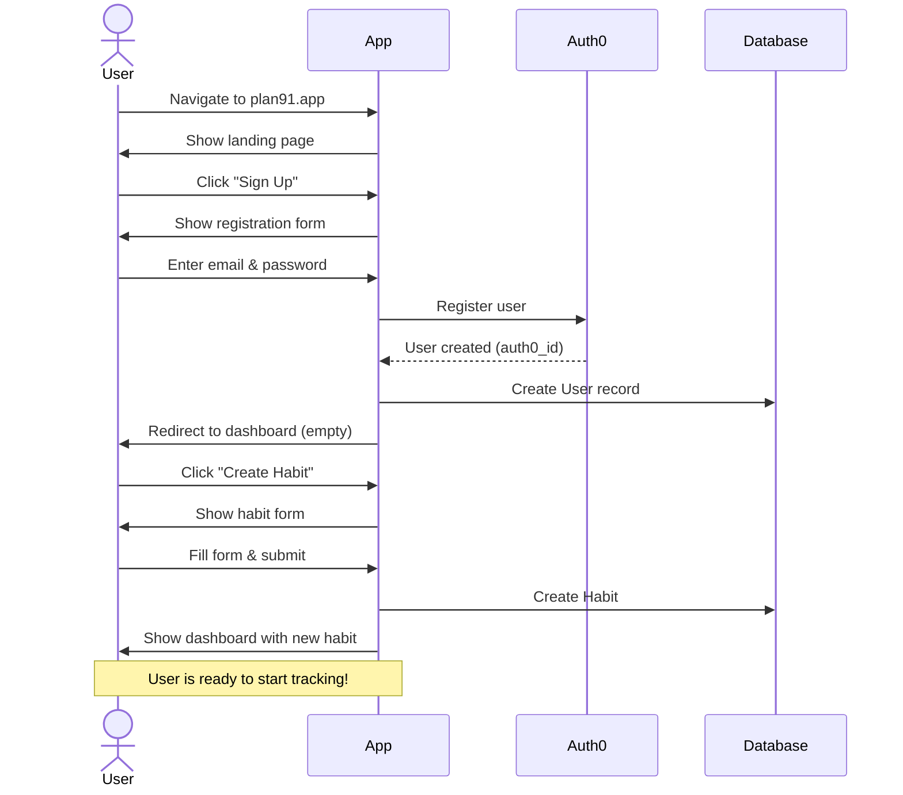
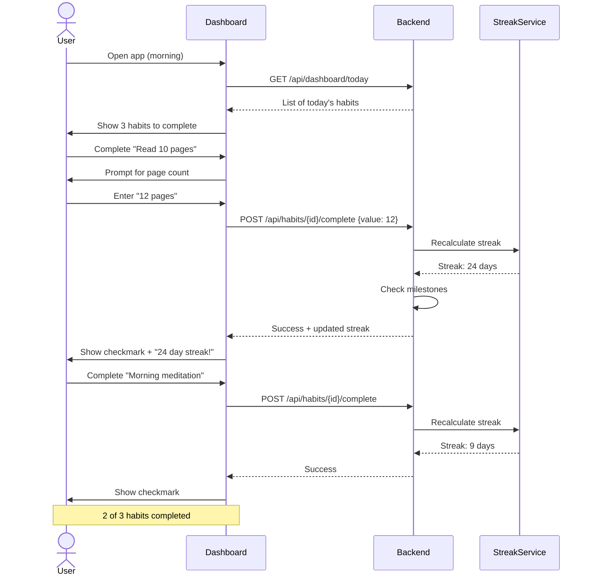
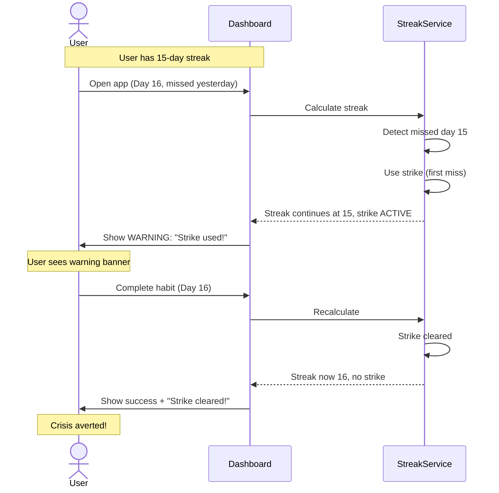

# Plan 91 - Use Cases

**Version**: 1.0
**Last Updated**: 2026-01-29

This document describes the primary use cases for Plan 91 using UML use case diagrams and detailed scenarios.

---

## Table of Contents

1. [Actor Definitions](#actor-definitions)
2. [Use Case Overview](#use-case-overview)
3. [Detailed Use Cases](#detailed-use-cases)
4. [User Journeys](#user-journeys)

---

## Actor Definitions

### Primary Actor
**User** - A person using Plan 91 to track their habits

### Supporting Actors
- **Auth0** - External authentication service
- **Notification System** - Sends milestone notifications
- **Analytics Engine** - Generates statistics and charts

---

## Use Case Overview

```mermaid
graph TB
    User((User))

    subgraph "Authentication"
        UC01[Register Account]
        UC02[Login]
        UC03[Logout]
        UC04[Update Profile]
    end

    subgraph "Habit Management"
        UC05[Create Habit]
        UC06[Edit Habit]
        UC07[Delete Habit]
        UC08[View Habit List]
        UC09[View Habit Details]
    end

    subgraph "Daily Tracking"
        UC10[View Today's Dashboard]
        UC11[Complete Habit]
        UC12[Add Entry with Note]
        UC13[Add Numeric Value]
        UC14[View Strike Warning]
    end

    subgraph "Analytics"
        UC15[View Habit Statistics]
        UC16[View Progress Charts]
        UC17[View Calendar Heatmap]
        UC18[View Category Breakdown]
        UC19[Export Data]
    end

    subgraph "Milestones"
        UC20[View Milestone Progress]
        UC21[Receive Achievement Notification]
        UC22[Complete 91-Day Journey]
        UC23[Choose Continue or Restart]
    end

    subgraph "Categories"
        UC24[Create Category]
        UC25[Edit Category]
        UC26[Delete Category]
        UC27[Filter by Category]
    end

    User --> UC01
    User --> UC02
    User --> UC03
    User --> UC04
    User --> UC05
    User --> UC06
    User --> UC07
    User --> UC08
    User --> UC09
    User --> UC10
    User --> UC11
    User --> UC12
    User --> UC13
    User --> UC14
    User --> UC15
    User --> UC16
    User --> UC17
    User --> UC18
    User --> UC19
    User --> UC20
    User --> UC21
    User --> UC22
    User --> UC23
    User --> UC24
    User --> UC25
    User --> UC26
    User --> UC27

    UC11 -.includes.-> UC12
    UC11 -.includes.-> UC13
    UC11 -.triggers.-> UC21
    UC22 -.includes.-> UC23

    style UC10 fill:#1F6F8B,color:#fff
    style UC11 fill:#1F6F8B,color:#fff
    style UC21 fill:#43a047,color:#fff
    style UC22 fill:#43a047,color:#fff
```



---

## Detailed Use Cases

### UC01: Register Account

**Actor**: User
**Precondition**: User has internet connection
**Postcondition**: User account created and logged in

**Main Flow**:
1. User navigates to registration page
2. User enters email and password
3. System validates email format and password strength
4. System creates account via Auth0
5. System creates User record in database
6. System sets default timezone
7. System logs user in
8. System redirects to dashboard

**Alternative Flows**:
- **3a. Invalid email**: Show error, return to step 2
- **3b. Weak password**: Show error, return to step 2
- **4a. Email already exists**: Show error, offer login instead

---

### UC05: Create Habit

**Actor**: User
**Precondition**: User is logged in
**Postcondition**: New habit created and visible on dashboard

**Main Flow**:
1. User clicks "Create Habit" button
2. System shows habit creation form
3. User enters habit name (required)
4. User enters description (optional)
5. User selects category
6. User chooses tracking type (Boolean or Numeric)
7. **If Numeric**: User configures unit, min, max, target
8. User selects recurrence rule
9. User submits form
10. System validates inputs
11. System creates Habit aggregate
12. System fires HabitCreated event
13. System shows success message
14. System redirects to dashboard

**Alternative Flows**:
- **10a. Validation fails**: Show errors, return to form
- **5a. No categories exist**: Prompt to create category first

**Business Rules Applied**:
- Name max 100 characters
- Description max 500 characters
- Start date set to today (in user's timezone)
- Initial streak is 0

---

### UC11: Complete Habit

**Actor**: User
**Precondition**: User is logged in, habit exists, today is an expected day
**Postcondition**: Habit marked complete, streak updated

**Main Flow**:
1. User views today's dashboard
2. System shows all habits expected today
3. User clicks "Complete" button for a habit
4. **If Numeric**: System prompts for numeric value
5. System validates completion
6. System creates HabitEntry
7. System recalculates streak
8. **If strike was active**: System clears strike
9. **If milestone reached**: System fires MilestoneAchieved event
10. System updates UI with new streak
11. System shows success feedback

**Alternative Flows**:
- **5a. Already completed today**: Show error "Already completed"
- **7a. Strike used**: Show warning "Strike used, don't miss tomorrow!"
- **7b. Streak broken**: Show message "Streak broken, starting fresh"
- **9a. Milestone reached**: Show celebration modal

**Business Rules Applied**:
- One completion per day
- Streak calculation follows one-strike rule
- Timezone-aware date checking
- Numeric value must meet min/max constraints (if configured)

---

### UC14: View Strike Warning

**Actor**: User
**Precondition**: User has missed an expected day but not broken streak
**Postcondition**: User aware of strike status

**Main Flow**:
1. User views dashboard
2. System detects habit has used strike
3. System displays warning banner on habit card
4. Warning shows: "Strike used! Don't miss tomorrow or your streak breaks"
5. Habit card styled with warning color

**Business Rules Applied**:
- Strike visible until next completion
- Warning color: amber/orange
- Clear call-to-action

---

### UC15: View Habit Statistics

**Actor**: User
**Precondition**: User is logged in, habit exists
**Postcondition**: User sees detailed statistics

**Main Flow**:
1. User navigates to Stats page
2. User selects habit from dropdown
3. System calculates statistics:
   - Current streak
   - Longest streak
   - Total completions
   - Completion rate
   - Days to 91
   - Average numeric value (if applicable)
4. System displays key metrics cards
5. **If numeric habit**: System shows line chart of values over time
6. System shows calendar heatmap (GitHub-style)
7. System shows weekly pattern breakdown

**Data Displayed**:
- Current Streak: 23 days
- Longest Streak: 23 days
- Total Completions: 23
- Completion Rate: 100%
- Days to 91: 68
- Average Value: 11.5 pages (for numeric habits)

---

### UC21: Receive Achievement Notification

**Actor**: User
**Precondition**: User completed habit and reached milestone
**Postcondition**: User celebrates achievement

**Main Flow**:
1. User completes habit (UC11)
2. System detects current streak matches milestone day
3. System fires MilestoneAchieved event
4. System shows celebration modal/notification
5. Modal displays:
   - Milestone achieved (e.g., "7 Day Streak!")
   - Encouraging message
   - Habit name and current streak
   - Visual celebration (animation, confetti effect)
6. User dismisses notification
7. Milestone marked as achieved in database

**Milestones**:
- Weekly: 7, 14, 21, 28, 35, 42, 49, 56, 63, 70, 77, 84
- Monthly: 30, 60
- Final: 91

---

### UC22: Complete 91-Day Journey

**Actor**: User
**Precondition**: User has current streak of 91 days
**Postcondition**: Habit marked complete, user chooses next step

**Main Flow**:
1. User completes 91st day
2. System detects streak == 91
3. System fires Habit91DaysComplete event
4. System sets habit.isCompleted = true
5. System shows grand celebration modal
6. Modal displays:
   - "🎉 91 Days Complete!"
   - Habit name
   - Summary statistics
   - Two options:
     - "Continue Tracking" (keep streak going)
     - "Mark Complete & Restart" (archive and start fresh)
7. User selects option
8. **If Continue**: Streak continues past 91
9. **If Restart**: System marks habit archived, redirects to create new habit

**Business Rules Applied**:
- This is a major milestone
- User gets to choose their path forward
- Archived habits preserved for history

---

### UC24: Create Category

**Actor**: User
**Precondition**: User is logged in
**Postcondition**: New category created

**Main Flow**:
1. User navigates to Categories page
2. User clicks "Create Category"
3. System shows category form
4. User enters category name
5. User selects color (hex color picker)
6. User selects icon/emoji (optional)
7. User submits form
8. System validates uniqueness of name
9. System creates Category aggregate
10. System shows success message
11. System refreshes category list

**Alternative Flows**:
- **8a. Name already exists**: Show error, return to form

**Business Rules Applied**:
- Category names unique per user
- Color must be valid hex (#RRGGBB)
- Icon optional

---

## User Journeys

### Journey 1: New User Onboarding



---

### Journey 2: Daily Habit Tracking



---

### Journey 3: Strike Usage and Recovery



---

### Journey 4: Milestone Achievement

```mermaid
sequenceDiagram
    actor User
    participant Dashboard
    participant Backend
    participant NotificationService

    Note over User: User completes 29th day

    User->>Dashboard: Complete habit
    Dashboard->>Backend: POST /api/habits/{id}/complete
    Backend->>Backend: Calculate streak = 30
    Backend->>Backend: Detect milestone (30 days!)
    Backend->>NotificationService: Fire MilestoneAchieved event
    Backend-->>Dashboard: Success + milestone data
    Dashboard->>User: Show celebration modal
    Note over Dashboard: 🎉 30-Day Milestone!
    User->>Dashboard: Click "Awesome!"
    Dashboard->>User: Return to dashboard with confetti

    Note over User: User feels motivated to continue
```



---

## Business Rule Validations

### Validation Matrix

| Use Case | Business Rules Enforced |
|----------|------------------------|
| UC01 - Register | Email format, password strength, unique email |
| UC05 - Create Habit | Name length, category exists, valid recurrence |
| UC11 - Complete Habit | One per day, timezone-aware, expected day check |
| UC15 - View Stats | Streak calculation, completion rate formula |
| UC21 - Milestone | Correct milestone days, event fired once |
| UC22 - 91 Complete | Exactly 91 days, user choice respected |
| UC24 - Create Category | Unique name per user, valid color hex |

---

## Error Scenarios

### Scenario: User tries to complete habit twice

```
Given: User completed "Read 10 pages" at 9:00 AM
When: User tries to complete same habit at 8:00 PM (same day)
Then: System shows error "Already completed today"
And: Completion button is disabled
And: Checkmark is visible
```

### Scenario: User misses two days in a row

```
Given: User has 20-day streak
And: User missed day 21 (strike used)
When: User misses day 22 (second consecutive miss)
Then: Streak breaks and resets to 0
And: System shows "Streak broken" message
And: hasUsedStrike resets to false
And: User can start fresh
```

### Scenario: Invalid numeric value

```
Given: Habit "Drink water" has min=1, max=10, unit="glasses"
When: User tries to enter value=15
Then: System shows error "Value must be between 1 and 10 glasses"
And: Completion is not saved
```

---

## Accessibility Considerations

All use cases must support:
- **Keyboard Navigation**: Tab through forms, Enter to submit
- **Screen Readers**: ARIA labels on all interactive elements
- **Color Contrast**: WCAG AA compliance (4.5:1 ratio)
- **Touch Targets**: Minimum 44x44px for mobile
- **Focus Indicators**: Clear visual focus states

---

## Performance Requirements

| Use Case | Performance Target |
|----------|-------------------|
| UC10 - Dashboard Load | < 500ms |
| UC11 - Complete Habit | < 200ms |
| UC15 - Stats Page Load | < 1s |
| UC16 - Chart Render | < 800ms |

---

**Last Updated**: 2026-01-29
**Next Review**: After Epic 3 implementation
