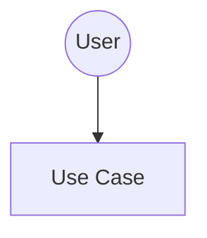

# PLAN91-002 - Add UML Use Case Diagrams to Documentation

**Epic**: 00-Setup
**Priority**: High
**Estimated Effort**: Small (1-2h)
**Dependencies**: PLAN91-001 (Documentation structure)
**Status**: ✅ Completed

## Context

Use case diagrams help communicate the functional requirements to both technical and non-technical stakeholders. They provide a visual overview of what users can do with the system.

This ticket creates comprehensive UML use case diagrams using Mermaid syntax so they're version-controlled and easily maintainable.

## Domain Knowledge Required

- Understanding of UML use case diagram notation
- Familiarity with Plan 91 functional requirements
- Knowledge of primary user workflows

Reference: PLAN91_SPECIFICATION.md § Functional Requirements

## Acceptance Criteria

- [x] USE-CASES.md file created in /docs
- [x] Use case overview diagram with all major use cases
- [x] Detailed documentation for key use cases
- [x] User journey sequence diagrams
- [x] Error scenarios documented
- [x] All diagrams use Mermaid syntax
- [x] Diagrams render correctly in GitHub/markdown viewers

## Technical Requirements

### Implementation Details

Create `/docs/USE-CASES.md` with:
1. Actor definitions
2. High-level use case diagram
3. Detailed use case specifications
4. User journey sequence diagrams
5. Business rule validations
6. Error scenarios

### Use Cases to Document

**Core Use Cases** (Priority 1):
- Register Account (UC01)
- Create Habit (UC05)
- Complete Habit (UC11)
- View Statistics (UC15)
- Milestone Achievement (UC21)
- 91-Day Completion (UC22)
- Create Category (UC24)

**Supporting Use Cases** (Priority 2):
- Login/Logout
- Edit Habit
- Delete Habit
- View Dashboard
- Add Notes
- Track Numeric Values

### Diagram Format

Use Mermaid for all diagrams:


## Definition of Done

- [x] USE-CASES.md created with all sections
- [x] All core use cases documented
- [x] At least 4 user journey diagrams
- [x] Error scenarios covered
- [x] Mermaid diagrams render correctly
- [x] Document reviewed for clarity
- [x] Cross-referenced with SPECIFICATION.md

## Example Structure

```markdown
# Plan 91 - Use Cases

## UC05: Create Habit

**Actor**: User
**Precondition**: User is logged in
**Postcondition**: New habit created

**Main Flow**:
1. User clicks "Create Habit"
2. System shows form
3. ...

**Alternative Flows**:
- 3a. Validation fails: ...
```

## References

- PLAN91_SPECIFICATION.md § Functional Requirements
- UML Use Case Diagrams: https://www.uml-diagrams.org/use-case-diagrams.html
- Mermaid Syntax: https://mermaid.js.org/

## Notes for Agent

- Focus on clarity over completeness
- Include sequence diagrams for complex flows
- Document the "happy path" first
- Add alternative flows for critical use cases
- Make sure diagrams are simple and readable

---

**Completed**: 2026-01-29
**Agent**: Claude Sonnet 4.5
